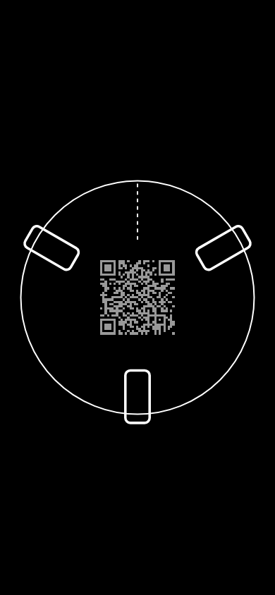

# Points North — for games around tables

An experimental platform for games around tables, with friends. When you're sat around a table, with your phone in front of you, simply comparing compass bearings tells your position in the circle. Points North starts to explore what interactions are then possible. 

This prototype currently supports two interactions:

- **Tap** a device's shape to send it a `message`, flashing its screen
- **Swipe** left/right to message whichever device is immediately to your left/right around the ring

To try it visit http://davidchatting.com/pointsnorth/, enable the compass, and show the QR code to your friends. Points North should work with any modern smartphone or tablet, with a compass.

## Game

<!-- screenshot.png is regenerated on every push to main by
     .github/workflows/screenshot.yml (headless Chromium via Playwright,
     see .github/workflows/screenshot.js) - don't hand-edit it. -->
<p align="center">
  <br>
  <sub>The *game* shows a bird's-eye view of the phones and tablets around the table.</sub>
</p>

The *game* is a [p5.js](https://p5js.org) sketch (`script.js`) that draws a compass
ring: your own device sits at the centre, and every other device in the session appears as a
rectangle scaled to their screen size and rotated to their real-world position (calculated from the
`deviceorientation`) — so a group of phones and tablets round a table shows up as a matching ring
of shapes pointing the right way. The first device will generate a unique `sessionId` that is then shared via the QR code displayed on screen.

This is meant as a reusable base — session/client plumbing, the bearing-ordered device list, and
the WebSocket relay — for building actual round-table games on top of - consider the card game [Bang!](https://en.wikipedia.org/wiki/Bang!_(card_game))

## Server

```
npm install
node server.js
```

The server then runs at `http://localhost:3000`.

`server.js` is a minimal Express + [`ws`](https://github.com/websockets/ws) WebSocket relay — it
has no game logic of its own. Clients connect to `wss://<host>/pubgames` and join a *session* by
sending a `client_info` message containing a `sessionId` (the value encoded in the join QR code).
The server keeps a `Map` of `sessionId -> Set<WebSocket>` and relays JSON messages between clients
in the same session:

- a message with a `targetClientId` is delivered to that one client
- otherwise it's broadcast to every other client in the session

When a client disconnects, the rest of its session receive a `disconnect` message. There's no
persistence and no HTTP API beyond serving `public/` as static assets — each game built on top of
this defines its own message types and client-side behaviour.

## Credits

Based on an idea co-developed with [Edward Jenkins](https://edjenkins.co.uk).

## License

This code is licensed under the [MIT License](LICENSE).
